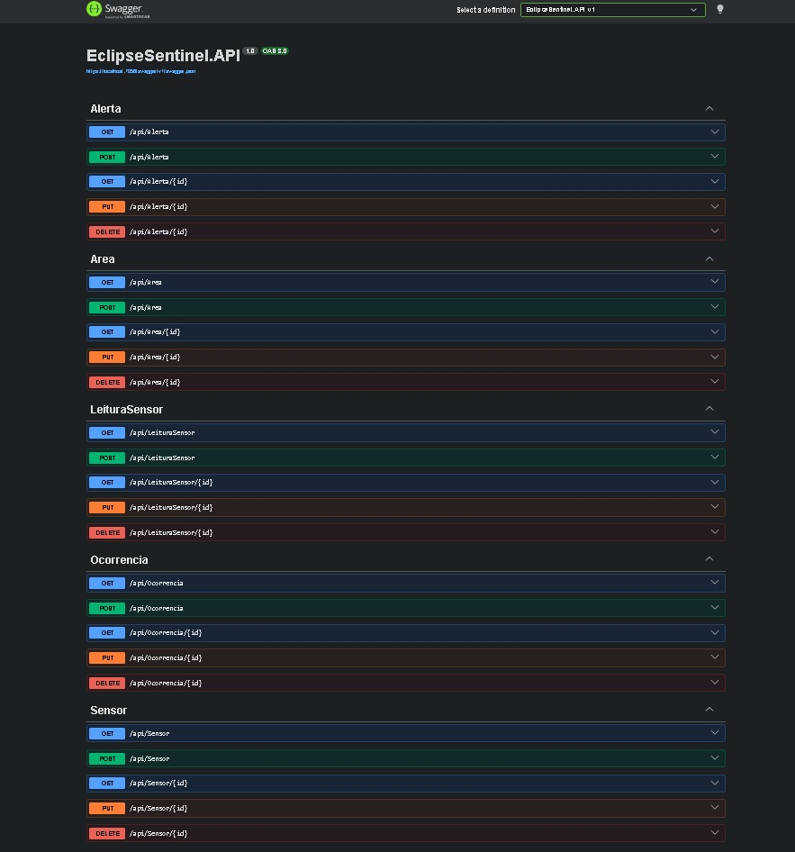
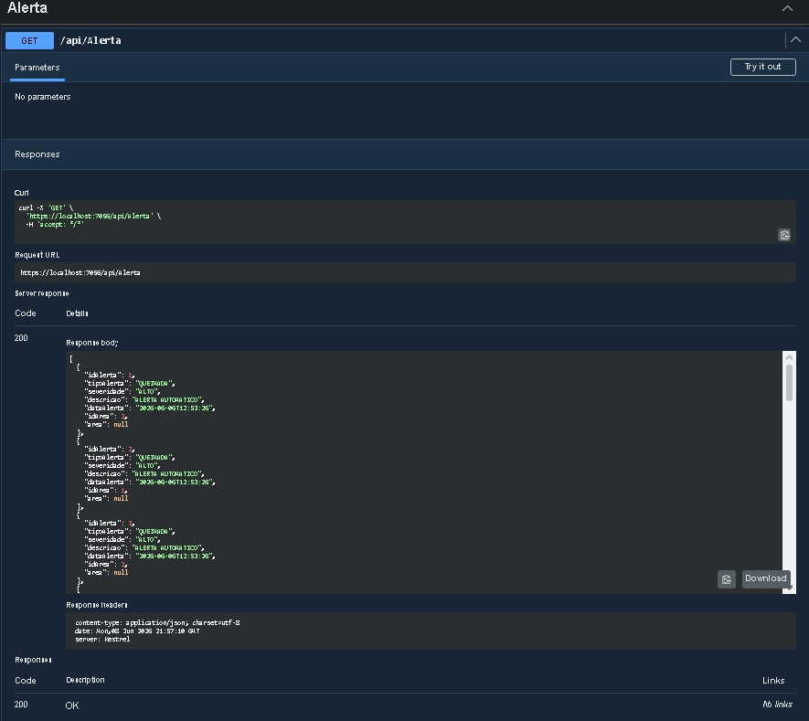
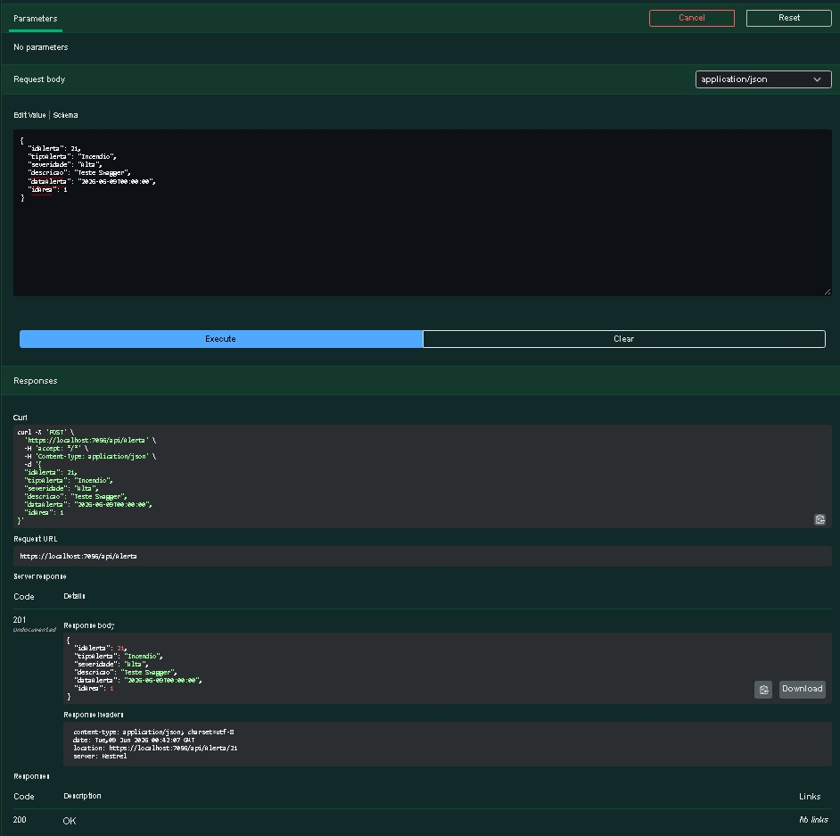

# Eclipse Sentinel API

## Integrantes

- Kaique Mascarenhas dos Santos RM565802
- Felipe Augusto Lopes Ferreira RM563982

---

# Sobre o Projeto

O Eclipse Sentinel é uma plataforma inteligente voltada para monitoramento ambiental e prevenção de desastres naturais.

A solução utiliza sensores distribuídos em áreas monitoradas para coletar dados ambientais em tempo real, permitindo identificar situações de risco e apoiar órgãos como a Defesa Civil na tomada de decisões.

A API foi desenvolvida utilizando ASP.NET Core 8, Entity Framework Core e Oracle Database.

---

# Tecnologias Utilizadas

- ASP.NET Core 8
- C#
- Entity Framework Core 8
- Oracle Database
- Oracle Entity Framework Core
- Swagger / OpenAPI
- REST API

---

# Estrutura do Projeto

```text
EclipseSentinel.API
│
├── Controllers
│   ├── AreaController.cs
│   ├── SensorController.cs
│   ├── LeituraSensorController.cs
│   ├── AlertaController.cs
│   └── OcorrenciaController.cs
│
├── Models
│   ├── Area.cs
│   ├── Sensor.cs
│   ├── LeituraSensor.cs
│   ├── Alerta.cs
│   └── Ocorrencia.cs
│
├── Data
│   └── EclipseContext.cs
│
├── Migrations
│   └── InitialCreate
│
├── Program.cs
│
└── appsettings.json
```

---

# Modelo das Entidades

```text
Área
 ├─ IdArea
 ├─ Nome
 ├─ Latitude
 ├─ Longitude
 ├─ NivelRisco
 └─ StatusArea

Sensor
 ├─ IdSensor
 ├─ TipoSensor
 ├─ StatusSensor
 └─ IdArea

LeituraSensor
 ├─ IdLeitura
 ├─ Temperatura
 ├─ Umidade
 ├─ Fumaca
 ├─ DataLeitura
 └─ IdSensor

Alerta
 ├─ IdAlerta
 ├─ TipoAlerta
 ├─ Severidade
 ├─ Descricao
 ├─ DataAlerta
 └─ IdArea

Ocorrencia
 ├─ IdOcorrencia
 ├─ Descricao
 ├─ DataOcorrencia
 ├─ ImagemUrl
 ├─ IdUsuario
 └─ IdArea
```

---

# Relacionamentos

```text
Área (1)
 │
 └── Sensor (N)

Sensor (1)
 │
 └── LeituraSensor (N)

Área (1)
 │
 └── Alerta (N)

Área (1)
 │
 └── Ocorrencia (N)
```

---

# Banco de Dados Oracle

Tabelas utilizadas:

```text
GS_ECLIPSE_AREA

GS_ECLIPSE_SENSOR

GS_ECLIPSE_LEITURA_SENSOR

GS_ECLIPSE_ALERTA

GS_ECLIPSE_OCORRENCIA
```

---

# Migration

Foi utilizada Migration do Entity Framework Core para versionamento da estrutura do banco de dados.

Migration criada:

```text
InitialCreate
```

Arquivos gerados:

```text
Migrations
│
├── InitialCreate.cs
├── InitialCreate.Designer.cs
└── EclipseContextModelSnapshot.cs
```

---

# Endpoints Disponíveis

## Área

```http
GET    /api/Area
POST   /api/Area
GET    /api/Area/{id}
PUT    /api/Area/{id}
DELETE /api/Area/{id}
```

## Sensor

```http
GET    /api/Sensor
POST   /api/Sensor
GET    /api/Sensor/{id}
PUT    /api/Sensor/{id}
DELETE /api/Sensor/{id}
```

## LeituraSensor

```http
GET    /api/LeituraSensor
POST   /api/LeituraSensor
GET    /api/LeituraSensor/{id}
PUT    /api/LeituraSensor/{id}
DELETE /api/LeituraSensor/{id}
```

## Alerta

```http
GET    /api/Alerta
POST   /api/Alerta
GET    /api/Alerta/{id}
PUT    /api/Alerta/{id}
DELETE /api/Alerta/{id}
```

## Ocorrencia

```http
GET    /api/Ocorrencia
POST   /api/Ocorrencia
GET    /api/Ocorrencia/{id}
PUT    /api/Ocorrencia/{id}
DELETE /api/Ocorrencia/{id}
```

---

# Exemplo de Teste

## POST Alerta

### Request

```json
{
  "idAlerta": 1,
  "tipoAlerta": "Incêndio",
  "severidade": "Alta",
  "descricao": "Fumaça detectada na região",
  "dataAlerta": "2026-06-08T10:00:00",
  "idArea": 1
}
```

### Response

```json
{
  "idAlerta": 1,
  "tipoAlerta": "Incêndio",
  "severidade": "Alta",
  "descricao": "Fumaça detectada na região",
  "dataAlerta": "2026-06-08T10:00:00",
  "idArea": 1
}
```

---

# Evidências de Funcionamento

## Swagger Completo



---

## GET Alerta



---

## POST Alerta



---

# Como Executar

## Restaurar Dependências

```bash
dotnet restore
```

## Executar Aplicação

```bash
dotnet run
```

## Acessar Swagger

```text
https://localhost:7056/swagger
```

---

# Atendimento aos Requisitos

### API REST

✔ ASP.NET Core

### Banco de Dados Relacional

✔ Oracle Database

### Relacionamentos

✔ Área → Sensor (1:N)

✔ Sensor → LeituraSensor (1:N)

✔ Área → Alerta (1:N)

✔ Área → Ocorrência (1:N)

### Migration

✔ Entity Framework Core Migration

### Documentação

✔ README

✔ Exemplos de teste

✔ Swagger

---

# Diferenciais da Solução

- Monitoramento ambiental
- Cadastro de áreas monitoradas
- Cadastro de sensores
- Histórico de leituras ambientais
- Controle de alertas
- Registro de ocorrências
- Oracle Database
- API REST documentada

---

# Conclusão

O Eclipse Sentinel oferece uma solução para monitoramento ambiental e prevenção de desastres naturais por meio da integração entre áreas monitoradas, sensores, leituras ambientais, alertas e ocorrências.

A aplicação foi desenvolvida utilizando ASP.NET Core, Entity Framework Core e Oracle Database, atendendo aos requisitos propostos para a disciplina Advanced Business Development with .NET.
